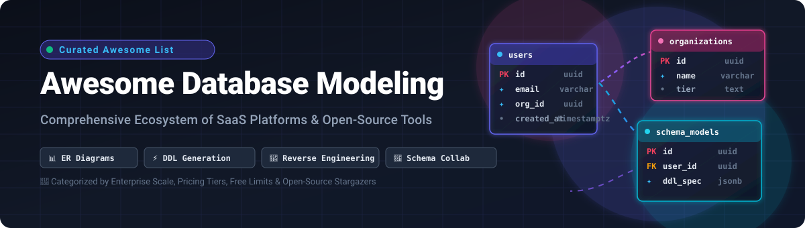

<p align="center">
  
</p>

<p align="center">
  <a href="https://github.com/ishandutta2007/Awesome-Awesome-Awesome"></a><a href="https://discord.gg/jc4xtF58Ve"></a>
  <a href="https://github.com/ishandutta2007/Awesome-Database-Modeling/stargazers"></a>
  <a href="https://github.com/ishandutta2007/Awesome-Database-Modeling/network/members"></a>
  <a href="https://github.com/ishandutta2007/Awesome-Database-Modeling/pulls"></a>
  <a href="https://github.com/ishandutta2007/Awesome-Database-Modeling/blob/main/LICENSE"></a><a href="https://github.com/ishandutta2007"></a>
</p>

---

# 🚀 Awesome Database Modeling & Schema Design

> A curated directory of leading **SaaS Platforms** and **Open-Source Tools** for **Database Modeling, Entity-Relationship (ER) Diagramming, Schema Engineering, Reverse Engineering, and DDL Generation**.

Whether you are designing a high-throughput relational schema, reverse-engineering an existing production database, maintaining diagram-as-code in Git, or managing enterprise-wide data governance, this collection tracks top-tier tools categorized by scale, pricing tiers, and community traction.

---

## 📑 Table of Contents
- [🌐 SaaS / Hosted Platforms](#-saashosted-platforms)
  - [📊 Market Overview & Dynamics](#-market-overview--dynamics)
  - [🏆 SaaS Platforms Matrix (Sorted by Scale)](#-saas-platforms-matrix)
- [💻 Open-Source GitHub Projects](#-open-source-github-projects)
  - [🌟 Top Open-Source Tools (Sorted by Stars)](#-top-open-source-tools)
  - [🔧 Additional Open-Source Ecosystem Solutions](#-additional-open-source-ecosystem-solutions)
- [🎯 Selection & Architecture Guide](#-selection--architecture-guide)
- [📈 Star History](#-star-history)
- [🤝 How to Contribute](#-how-to-contribute)
- [📜 Disclaimer & License](#-disclaimer--license)

---

## 🌐 SaaS/Hosted Platforms

### 📊 Market Overview & Dynamics

> **Estimated Market Size & Industry Dynamics:**  
> The global **Database Modeling, ER Diagramming, and Schema Architecture Software market** is estimated at **$1.8 Billion – $2.6 Billion in 2026** (projected to exceed **$4.5 Billion by 2032** at a **13.5% CAGR**). The sector is **moderately fragmented**: long-standing enterprise suites (such as SAP PowerDesigner, Quest Toad/erwin, and Idera ER/Studio) capture high-ticket enterprise contracts in heavily regulated environments, while agile, browser-first, and diagram-as-code SaaS solutions (SqlDBM, Lucidchart, dbdiagram.io, Eraser.io, DrawSQL, and Mermaid Chart) capture rapid bottom-up adoption among software engineers, data architects, and agile product teams.

---

### 🏆 SaaS Platforms Matrix

*Sorted in descending order by estimated company scale, valuation, and enterprise revenue.*

| 🛠️ Product | 🏢 Company Scale / Valuation | 📝 Description | 💳 Starting Pricing | 🎁 Free Tier / Trial Limits |
| :--- | :--- | :--- | :--- | :--- |
| **[SAP PowerDesigner](https://www.sap.com/products/technology-platform/powerdesigner.html)** | **~$250B+ Market Cap**<br>*(€36.8B / $42B Revenue, Public: SAP)* | Enterprise modeling suite covering data, business process, and enterprise architecture models with extensive governance and metadata repository capabilities. | Starts at ~$3,000–$4,500/license (quote-based per named user / concurrent license) | **30-day free trial** (fully functional DataArchitect evaluation edition upon registration; no permanent free tier). |
| **[Toad Data Modeler](https://www.quest.com/products/toad-data-modeler/)** | **$5.4B Valuation**<br>*(~$850M–$1B Revenue, Clearlake Capital / Quest)* | Visual database modeling, physical design, and reverse-engineering tool supporting 40+ database platforms across relational and warehouse engines. | Starts at ~$625/user/year (commercial term license) | **Free forever** (Freeware Edition: maximum 25 entities/objects per model) or **30-day full-featured free trial**. |
| **[ER/Studio](https://www.idera.com/er-studio-data-architect-software)** | **$3.0B Valuation**<br>*(~$500M–$750M Revenue, Idera / TA Associates)* | Flagship enterprise data modeling platform offering multi-platform logical and physical modeling, data lineage, business dictionaries, and team collaboration. | Starts at $2,687/user/year (Data Architect Standard edition) | **14-day free trial** (fully functional Data Architect evaluation with registration; no permanent free tier). |
| **[Lucidchart](https://www.lucidchart.com/)** | **$3.0B Valuation**<br>*(~$140M–$150M ARR, Lucid Software)* | Collaborative cloud-based visual diagramming application featuring automated ER diagram generation from SQL DDL imports and exports. | $7.95/month (billed annually) or $9.00/month (Individual plan) | **Free forever** (up to 3 editable documents, maximum 60 objects per document, 100 basic templates). |
| **[Vertabelo](https://vertabelo.com/)** | **~$100M–$150M Revenue**<br>*(~$500M+ Est. Valuation, Redgate Software)* | Modern web-based database modeler focusing on visual design, live team collaboration, schema migration scripts, and DDL generation. | Starts at $29/month or $290/year (Standard plan) | **14-day free trial** (full access; free academic accounts for verified students/teachers; Standard plan capped at 20 models & 100 tables/model). |
| **[SqlDBM](https://sqldbm.com/)** | **~$50M–$100M Valuation**<br>*(~$10M–$20M ARR, Venture Series A)* | Native cloud ER modeling platform built for Snowflake, Databricks, BigQuery, PostgreSQL, and SQL Server with Git integration and team versioning. | Starts at ~$99/user/month (or ~$1,500–$3,000/year base tier; annual enterprise billing) | **14-day free trial** via Snowflake Partner Connect / guided evaluation demo (1 active project during trial; no permanent free tier). |
| **[Navicat Data Modeler](https://www.navicat.com/en/products/navicat-data-modeler)** | **~$15M–$25M Revenue**<br>*(Profitable Independent, PremiumSoft)* | Cross-platform standalone modeling tool supporting conceptual, logical, and physical data models with database synchronization and reverse engineering. | $29.99/month (or $299.99/year subscription, $1,299 perpetual license) | **14-day full-featured free trial** (also offers Navicat Data Modeler Lite; 1-year free educational license for verified students). |
| **[Visual Paradigm](https://www.visual-paradigm.com/)** | **~$10M–$20M Revenue**<br>*(Profitable Independent)* | Comprehensive visual modeling software supporting Entity-Relationship Diagrams (ERD), UML, database engineering, DDL generation, and ORM code generation. | Starts at $6.00/month (Modeler edition) or $19.00/month (Standard edition) | **Free forever** (Community Edition: non-commercial personal/educational use, watermarked exports) or **30-day free trial** for paid editions. |
| **[Eraser.io](https://www.eraser.io/)** | **~$20M–$40M Valuation**<br>*(~$5M–$10M ARR, Venture Series A/Seed)* | Technical document canvas combining markdown notes, interactive architecture diagrams, and syntax-driven ER diagrams for engineering teams. | $15.00/user/month (billed annually) or $20.00/user/month (Professional plan) | **Free forever** (up to 3 files, 3 AI diagram generations, core canvas features). |
| **[dbdiagram.io](https://dbdiagram.io/)** | **~$5M–$10M ARR**<br>*(Holistics Software)* | Fast, code-first ER diagram designer for developers using declarative DBML (Database Markup Language) with instant DDL import/export. | $9.00/month (billed annually at $108/year) or $14.00/month (Personal Pro plan) | **Free forever** (up to 10 diagrams, public only, no private diagrams, unlimited tables per diagram). |
| **[Hackolade](https://hackolade.com/)** | **~$3M–$6M ARR**<br>*(Data Modeling IO)* | The premier visual data modeling tool designed specifically for NoSQL, document, key-value, graph, and polymorphic schemas (MongoDB, Cassandra, DynamoDB, JSON Schema). | Starts at €175/month or €1,750/seat/year (Professional Edition) | **Free forever** (Community Edition: browser-based, up to 50 model objects per model) or **14-day full-featured free trial** (no credit card required). |
| **[DbSchema](https://dbschema.com/)** | **~$2M–$5M ARR**<br>*(Wise Coders Solutions)* | Flexible universal database designer and admin client with interactive ER diagrams, schema reverse engineering, SQL editor, and visual query builder. | Starts at $29.40/month or $196 perpetual license (Personal Pro edition; $294 Business Pro) | **Free forever** (Community Edition: schema reverse engineering, ER diagrams, SQL editor) or **15-day free trial** (extendable to 30 days) for Pro edition. |
| **[Mermaid Chart](https://www.mermaidchart.com/)** | **~$10M–$15M Valuation**<br>*(~$1M–$3M ARR, Venture Seed)* | Cloud collaboration platform built on Mermaid.js text-to-diagram standard, featuring visual editing, AI diagram generation, and IDE plugins. | $10.00/user/month (billed annually) or $12.00/month (Plus plan) | **Free forever** (up to 5 diagrams, 60–75 lines per diagram complexity limit, 15 AI credits). |
| **[DrawSQL](https://drawsql.app/)** | **~$500K–$1M ARR**<br>*(Bootstrapped Indie)* | Intuitive, responsive, and collaborative online ER diagram builder designed for software developers and agile engineering teams. | $19.00/month (Starter plan, up to 5 users) | **Free forever** (public diagrams only, up to 15 tables per diagram). |
| **[QuickDBD](https://www.quickdatabasediagrams.com/)** | **~$300K–$700K ARR**<br>*(Bootstrapped Indie)* | Keyboard-first rapid database design tool that renders clean entity relationship diagrams live as you type simple text definitions. | $14.00/month or $7.00/week (Pro plan) | **Free forever** (1 editable diagram, up to 10 tables, public diagrams only). |
| **[DB Designer](https://www.dbdesigner.net/)** | **~$300K–$600K ARR**<br>*(Bootstrapped Indie)* | Online database schema designer with real-time team collaboration, SQL script generation, and multi-database export capabilities. | $6.00/month (Starter / Individual plan) | **Free forever** (up to 2 database models and up to 10 tables per model). |
| **[ERBuilder](https://www.softbuilder.com/)** | **~$200K–$500K ARR**<br>*(Softbuilder)* | Visual desktop data modeling software for designing relational databases, generating DDL scripts, validating schema rules, and generating test data. | Starts at $139/year (or $49/month Starter tier; perpetual licenses from $349) | **Free forever** (Free Edition: basic relational ER modeling, standard notations, visual design) or **15-day free trial** for Enterprise Edition. |
| **[Azimutt](https://azimutt.app/)** | **~$100K–$300K ARR**<br>*(Azimutt SAS)* | Schema search engine and visual explorer designed to help developers navigate, document, and analyze massive real-world database schemas. | €7.00/month (billed annually) or €10.00/month (Solo plan) | **Free forever** (unlimited public database exploration and schema visualization; up to 2 saved layouts/sources). |
| **[Moon Modeler](https://www.datensen.com/)** | **~$100K–$300K ARR**<br>*(Datensen s.r.o.)* | Visual desktop modeling software supporting MongoDB, PostgreSQL, MariaDB, MySQL, SQLite, and GraphQL schemas with detailed HTML/PDF reports. | $99.00 one-time perpetual license (Basic Edition) or $189.00 (Professional Edition) | **14-day free trial** (no credit card required; watermarked PDF exports, masked objects in HTML reports; no permanent free tier). |

---

## 💻 Open-Source GitHub Projects

Open-source tools offer resilient, privacy-preserving, and developer-friendly alternatives to proprietary software. Below are the most prominent open-source projects for database modeling, ER diagramming, schema version control, and documentation.

### 🌟 Top Open-Source Tools

*Sorted in descending order by GitHub Stargazer count.*

| 📦 Repository | ⭐ Stargazers Badge | 🎯 Primary Category | 📖 Description & Highlights |
| :--- | :--- | :--- | :--- |
| **[supabase/supabase](https://github.com/supabase/supabase)** | [](https://github.com/supabase/supabase/stargazers) | Visual Schema Designer & BaaS | Open source Firebase alternative with an interactive database visualizer, automated foreign key relationship mapping, and SQL table editor. |
| **[mermaid-js/mermaid](https://github.com/mermaid-js/mermaid)** | [](https://github.com/mermaid-js/mermaid/stargazers) | Diagram-as-Code (Markdown) | JavaScript-based diagramming and charting tool that renders markdown-inspired text definitions directly into interactive ER diagrams. |
| **[dbeaver/dbeaver](https://github.com/dbeaver/dbeaver)** | [](https://github.com/dbeaver/dbeaver/stargazers) | Universal GUI & ER Visualizer | Free universal database management tool supporting 100+ databases with automatic ER diagram generation, schema exploration, and data editing. |
| **[jgraph/drawio](https://github.com/jgraph/drawio)** | [](https://github.com/jgraph/drawio/stargazers) | Universal Diagramming Suite | Standalone and browser-based diagramming tool equipped with extensive Crow's Foot / Chen notation ER shapes and SQL DDL reverse-engineering import. |
| **[prisma/prisma](https://github.com/prisma/prisma)** | [](https://github.com/prisma/prisma/stargazers) | Declarative Schema Modeler | Next-generation Node.js & TypeScript ORM with a human-readable declarative modeling schema file, automated migrations, and visual data browser (Prisma Studio). |
| **[directus/directus](https://github.com/directus/directus)** | [](https://github.com/directus/directus/stargazers) | Real-time Data Engine & Modeler | Instant REST+GraphQL API and intuitive no-code data studio that wraps any SQL database, allowing visual table and relationship creation. |
| **[bytebase/bytebase](https://github.com/bytebase/bytebase)** | [](https://github.com/bytebase/bytebase/stargazers) | Database DevOps & Schema CI/CD | Database change management and schema migration platform with visual schema review, rollbacks, SQL linter, and GitOps workflows. |
| **[sqlc-dev/sqlc](https://github.com/sqlc-dev/sqlc)** | [](https://github.com/sqlc-dev/sqlc/stargazers) | Schema Compiler & Type-Safe SQL | Generates fully type-safe Go, Kotlin, and Python code from native SQL schema definitions and queries, ensuring schema integrity at compile time. |
| **[plantuml/plantuml](https://github.com/plantuml/plantuml)** | [](https://github.com/plantuml/plantuml/stargazers) | Text-to-Diagram Engine | Industry-standard open-source tool enabling engineers to generate clean entity-relationship diagrams, UML models, and architecture sketches from plain text. |
| **[sqlfluff/sqlfluff](https://github.com/sqlfluff/sqlfluff)** | [](https://github.com/sqlfluff/sqlfluff/stargazers) | SQL Linter & Schema Dialect Parser | Modular, configurable SQL linter and auto-formatter supporting multiple database dialects; ideal for enforcing schema consistency across dbt and SQL models. |
| **[ariga/atlas](https://github.com/ariga/atlas)** | [](https://github.com/ariga/atlas/stargazers) | Schema-as-Code & Migration Engine | Modern database schema management tool supporting declarative HCL/SQL modeling, automated migration planning, linting, and visual schema inspection. |
| **[pgmodeler/pgmodeler](https://github.com/pgmodeler/pgmodeler)** | [](https://github.com/pgmodeler/pgmodeler/stargazers) | PostgreSQL Visual Modeler | Dedicated visual PostgreSQL data modeling tool supporting full physical design, reverse engineering, model validation, and production DDL generation. |
| **[schemaspy/schemaspy](https://github.com/schemaspy/schemaspy)** | [](https://github.com/schemaspy/schemaspy/stargazers) | Automated Schema Doc Generator | Java-based command-line tool that analyzes relational database metadata via JDBC and outputs responsive HTML documentation with interactive ER diagrams. |
| **[azimuttapp/azimutt](https://github.com/azimuttapp/azimutt)** | [](https://github.com/azimuttapp/azimutt/stargazers) | Visual DB Explorer & Analyzer | Next-generation open-source schema analyzer and visual explorer designed to help developers navigate and understand complex production databases. |
| **[holistics/dbml](https://github.com/holistics/dbml)** | [](https://github.com/holistics/dbml/stargazers) | Database Markup Language | Open-source readable DSL designed to define and document relational schemas, with CLI tools to convert between DBML, SQL DDL, and JSON schemas. |
| **[k1LoW/tbls](https://github.com/k1LoW/tbls)** | [](https://github.com/k1LoW/tbls/stargazers) | CI-Friendly Schema Documenter | High-performance Go tool to document databases into GitHub-flavored Markdown, generating automated Mermaid/PlantUML ER diagrams in CI/CD pipelines. |
| **[sqitchers/sqitch](https://github.com/sqitchers/sqitch)** | [](https://github.com/sqitchers/sqitch/stargazers) | VCS-Centric Migration Tool | Sensible, Git-friendly database change management system that utilizes native SQL scripts rather than proprietary DSLs to version and verify schemas. |
| **[xo/xo](https://github.com/xo/xo)** | [](https://github.com/xo/xo/stargazers) | Schema-to-Code Generator | CLI utility that generates idiomatic code and schema types directly from existing PostgreSQL, MySQL, SQLite, and Oracle databases. |

---

### 🔧 Additional Open-Source Ecosystem Solutions

- **[Oracle SQL Developer Data Modeler](https://www.oracle.com/database/sqldeveloper/technologies/sql-data-modeler/)** — Free standalone graphical modeling tool from Oracle supporting conceptual, logical, and physical modeling across diverse databases.
- **[MySQL Workbench](https://www.mysql.com/products/workbench/)** — Visual database design, ER modeling, SQL development, and server administration for MySQL.
- **[pgAdmin 4](https://www.pgadmin.org/)** — Open-source management suite for PostgreSQL including built-in ERD Tool for visual schema design and reverse engineering.
- **[Liquibase](https://github.com/liquibase/liquibase)** & **[Flyway](https://github.com/flyway/flyway)** — Industry-standard schema migration engines that ensure version-controlled schema evolution across staging and production environments.
- **[Graphviz](https://graphviz.org/)** — Foundational open graph visualization engine often paired with custom scripts to render entity-relationship diagrams.

---

## 🎯 Selection & Architecture Guide

```
                      +----------------------------------+
                      | What is your primary objective? |
                      +-----------------+----------------+
                                        |
         +------------------------------+------------------------------+
         |                                                             |
         v                                                             v
+-------------------------+                               +-------------------------+
| Enterprise Governance   |                               | Agile Developer / Team  |
| & Polyglot Modeling     |                               | Schema Design           |
+------------+------------+                               +------------+------------+
             |                                                         |
    +--------+--------+                                       +--------+--------+
    |                 |                                       |                 |
    v                 v                                       v                 v
[SAP PowerDesigner] [Hackolade]                          [Diagram-as-Code]  [Visual SaaS / GUI]
[ER/Studio]         (NoSQL / Polymorphic)                - Mermaid.js       - SqlDBM
[Toad Modeler]                                           - DBML / dbdiagram - DrawSQL
                                                         - PlantUML         - Eraser.io
                                                         - Atlas / Prisma   - DBeaver / pgModeler
```

---

## 📈 Star History

[](https://star-history.dera.page/#ishandutta2007/Awesome-Database-Modeling&type=date&legend=top-left)

---

## 🤝 How to Contribute

Contributions are warmly welcomed! Help keep this curated ecosystem fresh and comprehensive:

1. 🍴 **Fork** this repository.
2. 🌿 **Create a branch** for your update: `git checkout -b add-tool-name`.
3. 📝 **Add or edit entries** in `README.md` following the tabular formatting and standards (include name, links, description, verified pricing, and exact free tier/trial limits).
4. 🚀 **Commit and submit a Pull Request** with a brief summary of the changes.

---

## 📜 Disclaimer & License

- **Disclaimer:** This repository is a community-curated directory intended for educational and evaluation purposes. All product names, logos, and brands are property of their respective owners.
- **License:** Distributed under the [MIT License](LICENSE).

---
<p align="center">
  <b>Built with ❤️ for database architects, backend engineers, and data teams worldwide.</b><br>
  <i>Design clean schemas before shipping code to production!</i>
</p>